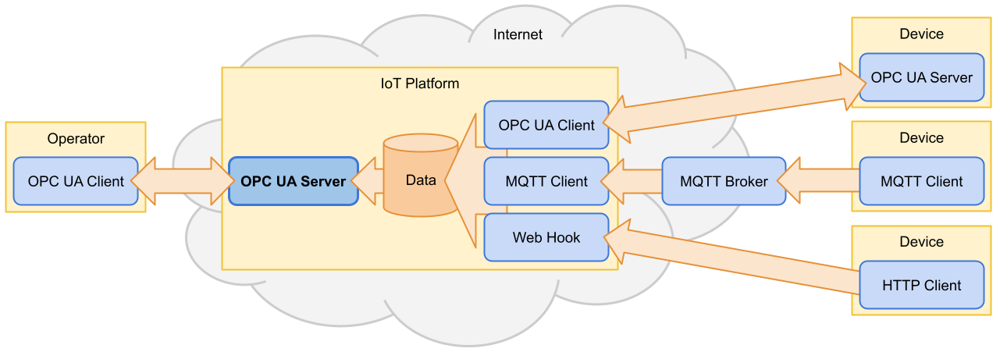
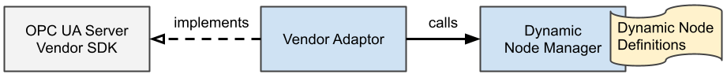

# OPC UA Dynamic Node Manager

Java library for modeling and integration of dynamic OPC UA information models.

It implements a dynamic node manager that responses dynamically based on the user context.

Aims to be easily integrated with [Prosys OPC UA SDK](https://www.prosysopc.com/products/opc-ua-java-sdk/) and [Eclipse Milo™](https://github.com/eclipse/milo) &sup1; OPC UA server SDK libraries.

&sup1; planed for Eclipse Milo™ 2.0

## Quick Start

Add necessary dependencies:

```xml
<dependency>
  <groupId>com.connectedcooking.opcua</groupId>
  <artifactId>opcua-dynamic-node-manager</artifactId>
  <version>0.2.4</version>
</dependency>
<dependency>
  <groupId>com.prosysopc.ua</groupId>
  <artifactId>prosys-opc-ua-sdk-client-server</artifactId>
  <version>5.2.4-147</version>
</dependency>
```

Create and register dynamic nodes:

```java
// create a new dynamic node manager
DynNodeManager dynNodeManager = new DynNodeManager();

// create and register the parent "Device{id}" node 
DynNode device = dynNodeManager.nodeBuilder()
    .object("Device<ID>")
    .registerAndGet();

// create and register the variable "SerialNumber" 
dynNodeManager.nodeBuilder()
    .childVariable("SerialNumber")
    .asProperty(device) // as a property of the parent
    .valueById(this::getSerialNumber) // get the value dynamically
    .register();

// ...

// retrieve a value based on the request
String getSerialNumber(UserContext ctx, Long deviceId) {
    if (!login(ctx.getUsername(), ctx.getCredentials())) {
        return null;
    }
    return deviceService.getDevice(deviceIde).getSernum();
}
```

Integrate the dynamic node manager via the adaptor:

```java
// get the vendor's OPC UA Server instance
UaServer server = getOpcUaServer();

// register the dynamic node manager under a namespace
String namespaceUri = "http://example.com/OPCUA/";
new ProsysDynNodeManagerAdaptor(server, namespaceUri, dynNodeManager);
```

The dynamic node will be then resolved to nodes such as `(ns=http://example.com/OPCUA/,s=Device123/SerialNumber)`.

See [examples](examples) for more details.

## Use Case

OPC UA is designed as an interface allowing a standardized read and write access to current data of devices for automation.

Today, a lot of cloud-based IoT platforms are around to simplify the access to data of devices via remote and centralized interfaces. Such platforms can profit from the benefits of OPC UA as well, not only by gathering data but also by providing data via standardized OPC UA interfaces.

Such an approach would require only minor or no changes at all in the established client processes. The IoT platform would serve as an OPC UA wrapper for potentially heterogeneous data from different sources.

The operator (client) would just handle a single set of OPC UA APIs to remotely access all data from multiple device with no need to establish a new connection to each device individually. 



As such a platform is typically a multi-tenant and multi-user system, we need to bring dynamic not only to data but also to the information model as well. The obvious requirement is confidentiality of data and meta-data; that means, a user should not see data of other users and also the structure (e.g. which device are in possession) must remain confident. The platform cannot simply hide the nodes by a different organization (views), it must ensure no information is visible to unauthorized users even not by guessing.

Another requirement is the ability to add and remove nodes dynamically based on the current user session.

### Example

Consider a cloud OPC UA server providing OPC UA interfaces for kitchen devices based on the Commercial Kitchen Equipment (OPC 30200) standard. The user Alice has two restaurants each with one combi steamer connected to the platform. Browsing the node DeviceSet should display two components of type definition CombiSteamerDeviceType:

```
DeviceSet
|_ Combi Steamer in Baker Street
\_ Combi Steamer in Elm Street
```

User Bob runs a cafe with three coffee machines. The cloud OPC UA server should respond with the DeviceSet node containing the following components of type definition CoffeeMachineDeviceType:  

```
DeviceSet
|_ Coffee Machine Bar 1
|_ Coffee Machine Bar 2
\_ Coffee Machine Kitchen
```

The platform must not show any combi steamers to Bob or coffee machines to Alice. That means, valid node IDs in Alice's session context must differ from those in Bob's session context.

## Dynamic Node Manager

The solution for the use case above is a dynamic node manager that is able to respond with a different information model based on the user session.

The dynamic node manager is set up by dynamic node definitions that specify nodes to browse based on the user context. 

First, create a new instance of the dynamic node manager:

```java
DynNodeManager dynNodeManager = new DynNodeManager();
```

Dynamic nodes IDs are based on variable parameters known to the user and therefore easy to guess such as internal IDs or serial numbers: 

```java
DynNode deviceNode = dynNodeManager.nodeBuilder()
  .object("Device_<ID>", CombiSteamerDeviceType)
  .canBrowseById((ctx, deviceId) -> hasDevice(ctx.getUsername(), deviceId))
  .registerAndGet();
```

The dynamic node ID is based on the internal device ID that will be parsed and used as a dynamic parameter together with the current user:

```java
// will be called for the node ID, e.g. (s="Device_123")
boolean hasDevice(String user, Long deviceId) {
  var userDevices = getDevicesFor(user);  
  return userDevices.contains(deviceId);
}
```

Depending on the return value of `hasDevice` the node is browsable for the current user or not.

Next, we assign the dynamic Device_&lt;ID&gt; node to the pre-defined DeviceSet node (from the DI namespace):
```java
dynNodeManager.assignSet(
  new RealNodeId(DI, 5001), // references a node in the DI standard       
  deviceNode.nodeId(),      // our dynamic device node
  (ctx, nodeId) -> getUserDeviceIds(ctx.getUsername(), nodeId));
```

We have to specify the function to get the particular device IDs (and node IDs accordingly) the user has access to:

```java
List<Long> getUserDeviceIds(String user, DynNodeId deviceNodeId) {
  var userDevices = getDevicesFor(user);
  return userDevices
        .map(deviceId -> deviceNodeId.toReal(deviceId))   // resolve real node IDs
        .collect(toList());
}
```

The references of the node must contain only concrete "real" node IDs; they are resolved from the dynamic node IDs by applying the concrete device IDs to the name pattern:

```java
RealNodeId realNodeId = new DynNodeId("Device_<ID>").toReal(123);

"Device_123".equals(realNodeId.identifier()); // true
```

Further, we can add some property to the device node:

```java
dynNodeManager.nodeBuilder()
  .childVariable("SerialNumber")
  .asProperty(deviceNode)
  .valueById((ctx, deviceId) -> getSernum(ctx.getUsername(), deviceId))
  .register();

String getSernum(String user, Long deviceId) {
  var userDevice = getDeviceFor(user, deviceId);
  return userDevice.getSernum();
}
```

Similar to object and variable components.

The last step is to initialize the adaptor for a specific OPC UA SDK, e.g. Prosys. Because we need to intercept calls to the DI information model (to fill DeviceSet dynamically), we need to reference its node manager in the dynamic node manager as well:

```java
UaServer server = startProsysUaServer();
NodeManager diNodeManager = server.getAddressSpace().getNodeManager(DI);

new ProsysDynNodeManagerAdaptor(
      server, NS_URI, NS_VERSION, dynNodeManager, List.of(diNodeManager));
```

See the whole source code for the Commercial Kitchen Equipment (OPC 30200) standard in [examples](examples/prosys/opc30200/src/main/java/com/connectedcooking/opcua/dynamicnodemanager/examples/prosys/opc30200/ProsysOpc30200Server.java).

### Dynamic Node Definitions

Dynamic nodes are specified by a set of vendor-independent definition objects. Which means, we can use the very same dynamic node definitions with different SDKs just by switching the adaptors:

```java
var dynNodeManager = setupDynNodeDefinitions();

// integration with the Prosys Server SDK:
var prosysServer = startProsysServer();
new ProsysDynNodeManagerAdaptor(prosysServer, ns, dynNodeManager);

// integration with the Eclipse Milo Server SDK:
var miloServer = startMiloServer();
new MiloDynNodeManagerAdaptor(miloServer, ns, dynNodeManager);
```

#### Dynamic vs. Real Node IDs

A dynamic node ID is a core attribute of a dynamic node. It is a compound of a namespace index and a string pattern. The pattern will be resolved to the node ID identifier of a concrete browsable node ID. It contains none or several placeholders enclosed in angle brackets `<>`, which are then replaced by concrete parameters.

Dynamic and resolved node IDs are represented with the classes `DynNodeId` and `RealNodeId` respectively:

```java
DynNodeId dynNodeId = new DynNodeId("Device<ID>");
RealNodeId realNodeId = dynNodeId.toReal(123);

"Device123".equals(realNodeId.identifier()); // true
```

The dynamic node manager searches for dynamic node IDs matching the requested real node ID and returns the first matching dynamic node, containing the resolved ID from request parameters.

All nodes that are not managed by the dynamic node manager must be referenced by real node IDs.

#### Partial Node IDs

Partial node IDs are dynamic node IDs that are not unique in the namespace and cannot exist without a parent node with a unique node ID. Partial node IDs are prefixed with the parent node ID (or IDs when the parent node ID is partial as well) separated by a slash `/`.

```java
new PartialNodeId("Device<SerNum>/Errors/Err<ID>/Msg");
```

#### Dynamic Nodes Builders

The dynamic node manager provides a convenient way to create dynamic node definitions via fluent builders:

```java
var dynNode = dynNodeManager.nodeBuilder()
    .object("MyNode")
    .registerAndGet();
```

The above listed code is equivalent to the following definition without the usage of builders:

```java
var dynAttrs = new DynAttributeManager();
dynAttrs.setNodeId((ctx, nid, dnode) -> new RealNodeId("MyNode));
dynAttrs.setNodeClass((ctx, nid, dnode) -> DynAttributes.NodeClasses.Object);
dynAttrs.setBrowseName((ctx, nid, dnode) -> new DynQualifiedName("MyNode"));
dynAttrs.setDisplayName((ctx, nid, dnode) -> new DynLocalizedText("MyNode"));

var dynRefs = new DynReferenceManager();
dynRefs.add(HasTypeDefinition, (ctx, nid, dnode) -> new RealNodeId(0, 58));   // BaseObjectType

var dynNodeId = new DynNodeId("MyNode");

var dynNode = new BaseDynNode(dynNodeId, null, dynAttrs, dynRefs);

dynNodeManager.registerNode(dynNode);
```

#### Dynamic Object Components

```java                
dynNodeManager.nodeBuilder()
    .childObject("ChidNode")
    .asComponent(parentNode)
    .register();
```

Such a child node will have a composed node ID `MyNode/ChidNode`.

#### Dynamic Variables and Properties

```java
dynNodeManager.nodeBuilder()
    .childVariable("MyVariable")
    .asComponent(parentNode)
    .value((ctx, nid, dnode) -> 123)
    .register();

dynNodeManager.nodeBuilder()
    .childVariable("MyProperty")
    .asProperty(parentNode)
    .value("Test")
    .register();
```

#### Assigning Dynamic Nodes

To create a starting point for browsing nodes we must assign a dynamic node to a standard real node e.g. the Objects folder:

```java
var objectsNodeId = new RealNodeId(0, 85);

var dynNodeId = new DynNodeId("Device<ID>");

dynNodeManager.assign(objectsNodeId, dynNodeId, (ctx, nid) -> nid.toReal());
```

## Metrics

There are basic micrometer.io metrics included:

- Counter `dynNodeManager.hasNode`
- Counter `dynNodeManager.hasNode.hits`
- Timer `dynNodeManager.readValue`
- Timer `dynNodeManager.readNonValue`

## Limitations

- Java version >= 11.
- Writing attributes is not supported.
- Method execution is not supported.
- Historizing is not supported.
- Event notifications are not supported.
- Only string-based node ID identifiers are supported.
- Only username authentication is supported.
- Localization is not supported.
- Role permissions is not supported.
- Only not-abstract symmetric references are supported.
- Loops in references are not supported (`containsNoLoops` is always true).

## Development

### Build

```shell
./mvnw clean install
```

### Architecture

The overall architecture of the dynamic node manager consists of three logical components:

- Vendor server SDK
- Vendor-specific Adaptor
- Node manager with dynamic node definitions

The adaptor implements the server interface to intercept the request to a specific namespace and provides a response by calling the dynamic node manager.



#### Dynamic Node Manager

The dynamic node manager is free of any vendor-specific details and can be used in multiple vendor adaptors without change.

It contains a set of definitions of dynamic nodes which are looked up when serving a request.

A dynamic node is a node with a dynamic node ID, dynamic attribute, and dynamic reference resolvers.

Dynamic nodes are resolved to concrete nodes based upon the request and the client context. 

## License

[MIT](https://github.com/connectedcooking/opcua-dynamic-node-manager/blob/main/LICENSE)

### TODO

- EventNotifier
- Method execution 
- Milo adaptor (for Milo 2.0)
