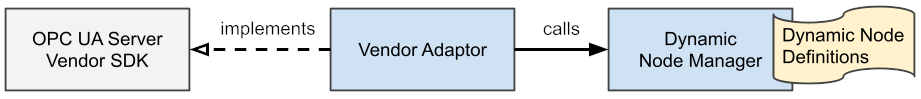

# OPC UA Dynamic Node Manager

Java library for modeling and integration of dynamic OPC UA node sets.

Implements a dynamic node manager that responses dynamically based on the user context.

Aims to be easily integrated with [Prosys OPC UA SDK](https://www.prosysopc.com/products/opc-ua-java-sdk/) and [Eclipse Milo™](https://github.com/eclipse/milo) OPC UA server libraries.

## Usage

Create and register dynamic nodes:

```java
// create a new dynamic node manager
DynNodeManager dynNodeManager = new DynNodeManager();

// create and register the parent "Device{id}" node 
DynNode device = dynNodeManager.nodeBuilder()
    .object("Device<ID>")
    .registerAndGet();

// create and register the variable "SerialNumber" 
dynNodeManager.nodeBuilder()
    .childVariable("SerialNumber")
    .asProperty(device) // as a property of the parent
    .valueById(this::getSernum) // get the value dynamically
    .register();

// ...

// retrieve a value based on the request
String getSernum(UserContext ctx, Long deviceId) {
    if (!login(ctx.getUsername(), ctx.getCredentials())) {
        return null;
    }
    return deviceService.getDevice(deviceIde).getSernum();
}
```

Integrate the dynamic node manager via the adaptor:

```java
// get the vendor's OPC UA Server instance
UaServer server = getOpcUaServer();

// register the dynamic node manager under a namespace
String namespaceUri = "http://example.com/OPCUA/";
new ProsysDynNodeManagerAdaptor(server, namespaceUri, dynNodeManager);
```

The dynamic node will be then resolved to nodes such as `(ns=http://example.com/OPCUA/,s=Device123/SerialNumber)`.

See [examples](examples) for more details.

### Limitations

- Java version >= 11.
- Method execution not supported.
- Only string-based node ID identifiers supported.
- Only username authentication is supported.
- Localization not supported.
- Role permissions not supported.
- Historizing not supported.

## Release Notes

No release yet

## Development

### Build

```shell
./mvnw clean install
```

### Architecture

The overall architecture of the Dynamic Node Manager consists from three logical components:

- Vendor Server SDK
- Vendor-specific Adaptor
- Node Manager with Dynamic Node definitions

The Adaptor implements the Server Interface to intercept the request to a specific namespace and provides a response by calling the Dynamic Node Manager.



#### Dynamic Node Manager

The Dynamic Node Manager is free of any vendor-specific details and can be used in multiple vendor Adaptors without change.

It holds a set of definitions of Dynamic Nodes which looks up when serving a request.

A Dynamic Node with a dynamic node ID, dynamic attribute, and dynamic reference resolvers.

The dynamic node ID, attributes, and references are resolved to concrete ones upon the request based on the client context. 

## License

[MIT](https://github.com/connectedcooking/opcua-dynamic-node-manager/blob/main/LICENSE)

### TODO

- IdType
- ArchUnit
- Doc/Wiki
- Milo adaptor (for Milo 2.0)